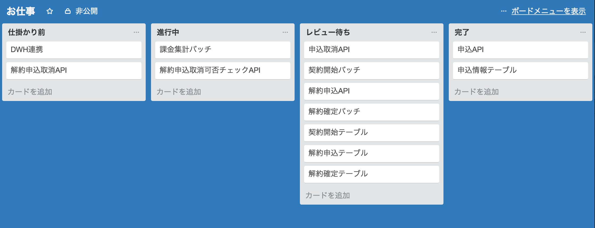

モブプログラミングやってみた
===

---
# 課題

レビューがすすまない

※イメージ

---
# レビューが進まない

- レビュイーとレビュワーは別の人
- レビュワーは別のストーリーをやっている
- レビュイーがレビュー待ちの間手が空く
- スプリント終盤にレビューコメントがつくとストーリーが完了しない
- レビュー待ちの状態の進捗が不明（クラス設計からやり直しなのか、軽い修正ですむのか）

---
# レビューが進まない理由

- レビュワーの思い出しコスト（これなんの機能だっけ？）
- プルリクエストのページ上でのコメント->質問->コメント->修正->コメント...の効率が悪い
- レビュー時間確保が難しい
- 質の悪いプルリク
	- 前にそのクラスをいじった人がOptimize Importを忘れているせいで関係ない差分がでているとか 

---
# モブプログラミングをやってみた

ベロシティが格段に向上した

---
# やり方

- プランニング時に１ストーリーに取り組む人を２人以上アサインする
- アサインされた人はホワイトボード、ディスプレイのあるテーブルを囲ってコーディングする
- 基本これだけ、あとは各自のやり方で

---
# 参考：DP※流

※人名です

- ホワイトボードにクラス図（詳細ではなくていい）を書いて設計の認識を合わせる
- インターフェースはペアプロで作る
- 実装部分は作業分担（パラでコーディング）
- 終わったら手を上げてレビュー依頼
- ディスプレイに写しながらコード解説->レビュー
- レビューが通ったらプルリクを出すが、レビューは終わっているので軽く確認してマージ
- 作業分担する時にテストとプロダクトコードで分担することもある

---
# 結果

- レビュー待ちで停滞することがないのでバーンダウンチャートがキレイになって進捗がわかりやすい
- 全体的にベロシティが向上した
- Intellijのショートカットなど、開発の小技を盗むことで各々が成長することができた